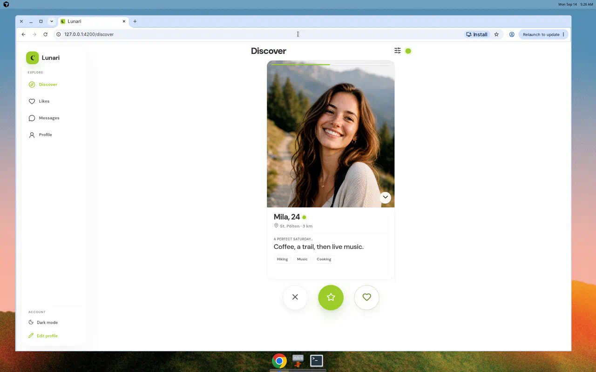
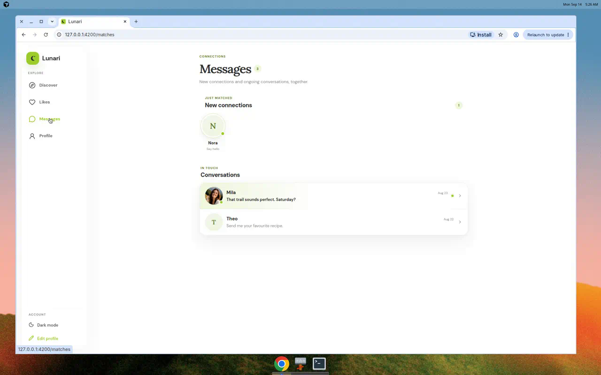
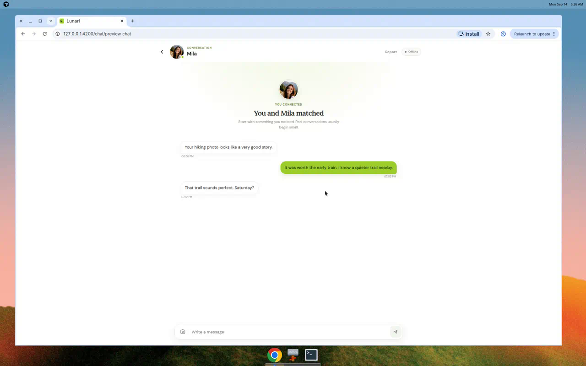
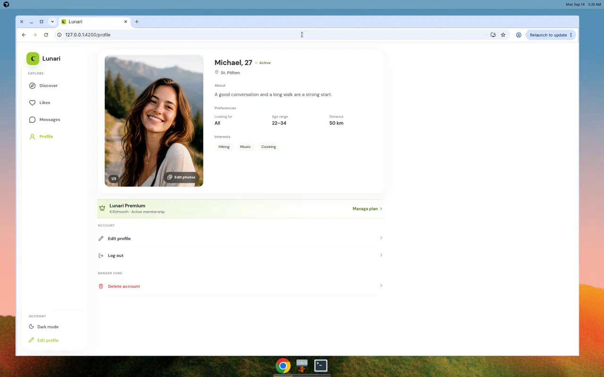

# Interview demo kit

Materials for showing this repository in a Java backend interview. The product name in production is Lunari.

Use this folder, not the full feature tree, as the starting point.

| Artifact | Purpose |
|---|---|
| [live-stand.md](live-stand.md) | Production URLs, preflight, operational traps |
| [script.md](script.md) | Six-minute walkthrough (Russian and English) |
| [talk-track.md](talk-track.md) | Three Java stories: problem, code, trade-off, test |
| [seed-notes.md](seed-notes.md) | How to fill a deck through events, never SQL |
| [cv-blurb.md](cv-blurb.md) | CV / LinkedIn wording and likely questions |
| [screenshots/](screenshots/) | UI stills plus the architecture diagram |
| [recording.md](recording.md) | Backup video status and how to publish a recruiter link |

## What to show

One path: two prepared accounts → Discover (`GET /api/v2/deck`) → mutual like → match → text chat.

Three stories if the interviewer goes deep: Deck Read CQRS, transactional outbox, gateway / mTLS / role-aware limits.

Product surfaces (design-preview fixtures, not the live origin):

## What not to present as finished

- Ranking admin and A/B experiments (`ADMIN` vs `USER_ADMIN` is still an owner decision).
- Popularity ranker on a live deck.
- Moderation Phase 5.
- Eureka / Config Server (legacy, off in production).
- Profiles inserted with SQL (deck-read stays `202 BUILDING`).

## Compact delivery record

This kit is a documentation and hygiene change. No HTTP, event, or database contract changed.

| Field | Value |
|---|---|
| Outcome | Recruiter-facing README, demo runbook, talk track, seed notes, CV blurbs, UI stills, backup recording script |
| Out of scope | Ranking R15, popularity on prod, moderation Phase 5, Angular redesign, ELK, full-service CI |
| Affected contract | none |
| Observable evidence | Live HTTPS probe recorded in `live-stand.md`; preview UI stills in `screenshots/`; README facts (`/api/v2/deck`, `swipes-go`) match code |
| Validation | `curl` against the public stand; `npm run build` for the client preview used in stills; no Maven suite (no Java behaviour change) |
| Rollback | Revert the documentation commit. Runtime behaviour is unchanged |
| Promotion | Still one slice. Live origin was down at probe time; that is recorded, not papered over |

## Phase ledger

| Sub-step | Status | Evidence or reason |
|---|---|---|
| R.1 Selected mode | Done | `compressed-small-change`: demo docs and repo hygiene, no new product API |
| R.2 Project profile | Done | Repo fallback tracker; English docs to match root README; tests stay in existing service trees |
| R.3 Omitted ceremony | Done | P1.1–P1.12, P2.*, P3.*, P4.10 Mode-omit |
| C.1 Outcome / out of scope | Done | Table above |
| C.2 Affected contract | Done | none |
| C.3 Observable evidence | Done | Probe + stills + README fact-check |
| C.4 Test levels and commands | Done | HTTPS probe; client preview build. Unit/IT/e2e N/A — no runtime change |
| C.5 Rollback | Done | Git revert; no runtime behaviour change |
| C.6 Promotion check | Done | One slice; live-stand outage recorded as operational fact |
| P1–P3 rows | Mode-omit | Compressed mode |
| P4.1 Slice plan | Done | This file |
| P4.2 Primary evidence | Done | Probe 522 in `live-stand.md`; stills in `screenshots/`; preview walkthrough `lunari_preview_ui_walkthrough.mp4` |
| P4.3 Implementation | Done | `docs/demo/*`, root README, `.gitignore` |
| P4.4 Test levels | Done | See C.4. Specialist N/A |
| P4.5 Error-path evidence | N/A | Documentation only; live 522 is recorded, not fixed here |
| P4.6 Review | Done | Self-review against the approved job-hunt plan |
| P4.7 Targeted defect review | Done | No product bug opened. Live origin 522 is an ops lead, owner-owned |
| P4.8 Quality gates | N/A | Policy/security CI unchanged; no new gate |
| P4.9 Handoff | N/A | Same session |
| P4.10 Combined-diff review | Mode-omit | One-slice mode |
| P5.1 Build | Done | Client preview build when capturing stills |
| P5.2 Security scan | N/A | No new attack surface |
| P5.3 Deploy | N/A | Not authorized to change the production origin |
| P5.4 Smoke | Done | Public HTTPS probe 2026-09-14: both hosts returned Cloudflare 522 |
| P5.5 Rollback | Done | Documentation revert |
| P5.6 Monitoring | N/A | Not yet observed on a restored origin |
| P5.7 Docs | Done | This kit plus root README |
| P5.8 Open risk | Done | Origin-down accepted with owner: restore before using the live URL in an interview |
