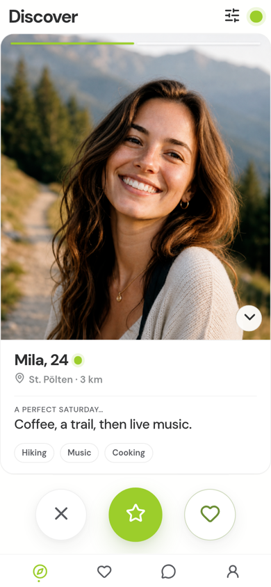
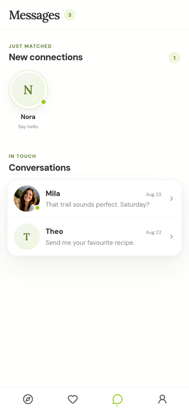
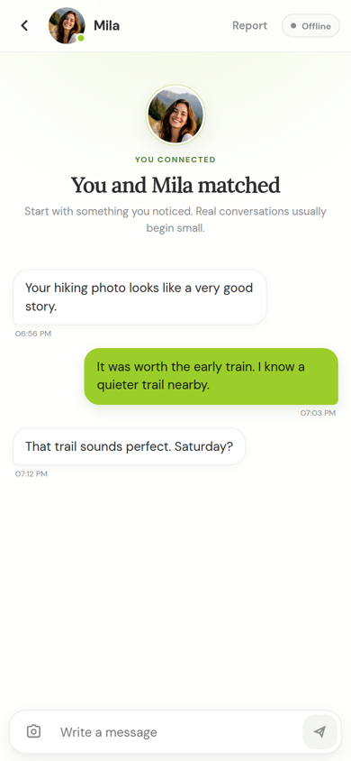
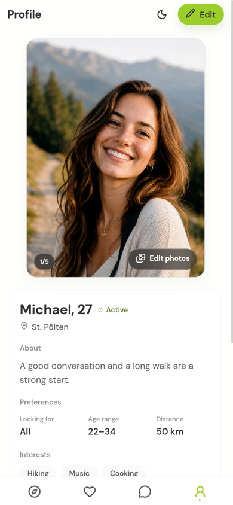

# Interview demo kit

Materials for showing this repository in a Java backend interview. The product name in production is Lunari.

Use this folder, not the full feature tree, as the starting point.

| Artifact | Purpose |
|---|---|
| [live-stand.md](live-stand.md) | Production URLs, preflight, operational traps |
| [script.md](script.md) | Six-minute walkthrough (Russian and English) |
| [decisions.md](decisions.md) | Why outbox, CQRS deck, mTLS, Quarkus on deck-read — rejected alternatives |
| [talk-track.md](talk-track.md) | Spoken version of those three stories |
| [stories.md](stories.md) | Same stories as GitHub issues #35–#37 |
| [seed-notes.md](seed-notes.md) | How to fill a deck through events, never SQL |
| [cv-blurb.md](cv-blurb.md) | CV / LinkedIn wording and likely questions |
| [screenshots/](screenshots/) | Desktop stills |
| [screenshots/mobile/](screenshots/mobile/) | Phone-width stills (bottom tabs) |
| [recording.md](recording.md) | Backup video status and how to publish a recruiter link |

## What to show

One path: two prepared accounts → Discover (`GET /api/v2/deck`) → mutual like → match → text chat.

Three stories if the interviewer goes deep: Deck Read CQRS, transactional outbox, gateway / mTLS / role-aware limits. Written answers: [decisions.md](decisions.md).

Product surfaces (design-preview fixtures, not the live origin). **Phone layout first:**

<p align="center">
  
  
  
  
</p>

## What not to present as finished

- Ranking admin and A/B experiments (`ADMIN` vs `USER_ADMIN` is still an owner decision).
- Popularity ranker on a live deck.
- Moderation Phase 5 (the service **is** in Compose and in the root README maps; live providers / release are not).
- Eureka / Config Server (legacy, off in production).
- Profiles inserted with SQL (deck-read stays `202 BUILDING`).

## GitHub About

The cloud-agent GitHub token is an integration: `PATCH /repos/...` and topics return **403**, and a browser session is not logged in as the owner. The empty About box on GitHub.com is still empty until you run this as **Misyk8925**:

```bash
gh auth login   # if needed
./scripts/set-github-about.sh
```

Copy and pin steps: [docs/github-about.md](../github-about.md). The root README repeats the same description and topics at the top so the first screen of the file is not blank.

## Local demo without Stripe / S3

```bash
./scripts/demo-up.sh          # certs + compose demo overlay
./scripts/demo-up.sh --check  # interpolation only, no containers
```


## Compact delivery record

This kit is a documentation, About copy, and local-demo launch change. No HTTP, event, or database contract changed.

| Field | Value |
|---|---|
| Outcome | Recruiter-facing README (About copy, Moderation maps, one-command demo), decisions doc, `.env.demo` + demo overlay |
| Out of scope | Ranking R15, popularity on prod, moderation Phase 5, Angular redesign, ELK, full-service CI, mutating GitHub About (403 for integration tokens) |
| Affected contract | none |
| Observable evidence | `ruby scripts/validate-demo-env.rb`; `./scripts/demo-up.sh --check` interpolates Compose; photos MemoryStorage tests; README Kafka/responsibility rows name moderation |
| Validation | Ruby demo-env policy; photos pytest for empty-bucket MemoryStorage; Compose `config` when Docker is present. Full stack not started (repo Cloud guidance) |
| Rollback | Revert the documentation/demo-env commit. Production Compose `:?` required secrets are unchanged |
| Promotion | Still one slice. GitHub About remains owner-token; live origin 522 is still recorded |

## Phase ledger

| Sub-step | Status | Evidence or reason |
|---|---|---|
| R.1 Selected mode | Done | `compressed-small-change`: demo launch files + README maps + decisions doc |
| R.2 Project profile | Done | Repo fallback tracker; English docs; tests in photos pytest + ruby policy scripts |
| R.3 Omitted ceremony | Done | P1.1–P1.12, P2.*, P3.*, P4.10 Mode-omit |
| C.1 Outcome / out of scope | Done | Table above |
| C.2 Affected contract | Done | none |
| C.3 Observable evidence | Done | validate-demo-env.rb; photos MemoryStorage; README moderation rows; decisions.md |
| C.4 Test levels and commands | Done | `ruby scripts/validate-demo-env.rb`; `python -m pytest services/photos/tests/test_storage.py`; `./scripts/demo-up.sh --check` when Docker exists. Full Compose up N/A (not started) |
| C.5 Rollback | Done | Git revert; production compose secrets unchanged |
| C.6 Promotion check | Done | One slice; GitHub About 403 accepted with owner script |
| P1–P3 rows | Mode-omit | Compressed mode |
| P4.1 Slice plan | Done | This file |
| P4.2 Primary evidence | Done | validate-demo-env; photos tests; demo-up --check |
| P4.3 Implementation | Done | `.env.demo`, `docker-compose.demo.yml`, `scripts/demo-up.sh`, `docs/demo/decisions.md`, README |
| P4.4 Test levels | Done | See C.4. Specialist N/A |
| P4.5 Error-path evidence | N/A | Launch config, not a product defect |
| P4.6 Review | Done | Self-review after context break against the four recruiter gaps |
| P4.7 Targeted defect review | Done | No product bug opened. Empty GitHub About is owner-owned |
| P4.8 Quality gates | Done | Policy job gains `validate-demo-env.rb` |
| P4.9 Handoff | N/A | Same session |
| P4.10 Combined-diff review | Mode-omit | One-slice mode |
| P5.1 Build | N/A | No Java/Go/Angular behaviour change |
| P5.2 Security scan | N/A | Demo passwords are local-only and documented as such |
| P5.3 Deploy | N/A | Not authorized to change GitHub About or the production origin |
| P5.4 Smoke | Done | `gh repo view` still empty About; validate-demo-env run in this slice |
| P5.5 Rollback | Done | Documentation/demo-env revert |
| P5.6 Monitoring | N/A | Not observed on a restored origin |
| P5.7 Docs | Done | README, decisions.md, github-about.md, this kit |
| P5.8 Open risk | Done | About-empty accepted with owner: run `set-github-about.sh`. Origin-down accepted with owner |
