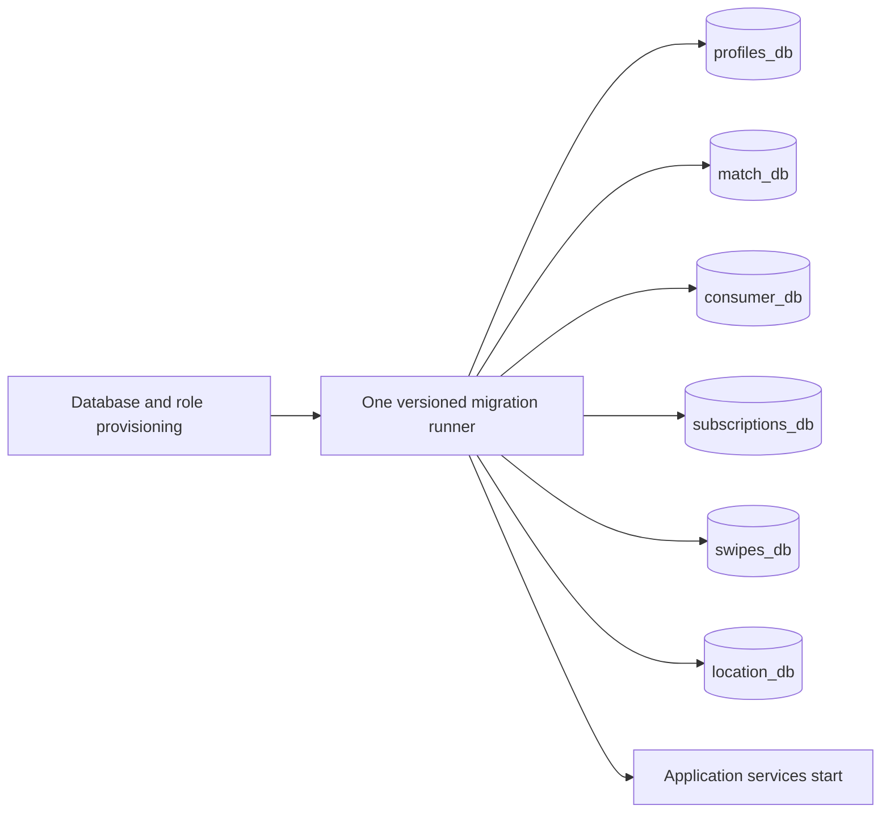

# Concept: Contract Conventions and Versioned Migrations

Status: APPROVED 2026-08-09  
Author: Codex with Michael · Slug: `contract-conventions-versioned-migrations`

## 1. Problem

The project maintainer and release operator need safe contract and database changes. Today, database SQL runs only when a new PostgreSQL volume is created. It cannot upgrade an existing volume. Several services can also change tables through Hibernate. This gives no single migration history and can cause schema drift.

The project also has an OpenAPI file and shared event classes, but it has no project-wide rule for canonical formats, compatibility checks, readable mirrors, or migration naming.

Today the maintainer must edit bootstrap SQL, rely on ORM updates, or recreate a database. This is not safe for stored user data and does not give reviewable release evidence.

## 2. Contracts and behaviour (plain text)

What goes in:

- Versioned SQL files owned by one application database.
- Existing database state and explicit database connection environment variables.
- Proposed HTTP, event, WebSocket, or schema contract changes.

What comes out:

- A project-wide contract conventions document.
- An ordered database schema and migration history with checksums.
- A clear success or failure result before application services start.
- Commands for clean bootstrap, repeat migration, and explicit adoption of an existing schema.

What the system promises:

- It manages all six application databases: profiles, match, consumer, subscriptions, swipes, and location.
- It applies each migration once and checks committed migration checksums.
- A second run with no new migration makes zero schema changes.
- Application services do not start when migration fails.
- Existing data is preserved during adoption.

What the system does not do:

- It does not change HTTP payloads, Kafka topics, or WebSocket behaviour.
- It does not manage the Keycloak database or recreate persistent volumes.
- It does not baseline an unknown non-empty schema automatically.
- It does not store database credentials in Git.
- It does not deploy or migrate a live production database as part of this repository change.

## 3. Functional requirements

| ID | Requirement | How we test it |
|---|---|---|
| FR-1 | The repository defines one project-wide convention for HTTP, events, WebSockets, database migrations, naming, readable mirrors, compatibility checks, and bug-audit cadence. | Review the conventions document against its required sections. |
| FR-2 | Each of the six application databases owns an ordered migration directory and a version-1 baseline migration. | Check the directory index and run migrations on empty databases. |
| FR-3 | Database and role provisioning completes before the migration runner starts, and migrations complete before dependent application services start. | Inspect Compose dependencies and force migration success and failure. |
| FR-4 | The migration runner records applied versions and checksums and skips already applied migrations. | Run it twice and inspect migration history. |
| FR-5 | A non-empty database with no migration history is rejected until an operator explicitly validates and baselines it. | Start against a legacy fixture, verify refusal, then baseline and migrate it. |
| FR-6 | Application services use schema validation, not automatic schema creation or update, in the production-shaped Compose stack. | Start with a matching and a mismatching schema. |
| FR-7 | A failed migration returns a non-zero result and blocks every dependent application service. | Add a temporary invalid migration and inspect container states. |
| FR-8 | The repository documents clean bootstrap, existing-schema adoption, normal migration, failure recovery, and backup expectations. | Dry-run every documented command against fixtures. |

## 4. Non-functional requirements

| ID | Requirement (with a number) | How we measure it |
|---|---|---|
| NFR-1 | Migration coverage is 6 of 6 application databases. | Compare the database inventory with migration-runner configuration. |
| NFR-2 | 100% of applied migration files have an ordered version and stored checksum. | Query each migration history table. |
| NFR-3 | A repeat run with no new files executes 0 schema DDL statements and exits successfully. | Compare schemas and history before and after the second run. |
| NFR-4 | If migration exits non-zero, 0 dependent application containers start. | Run the failure scenario and inspect Compose states. |
| NFR-5 | The adoption release contains 0 destructive schema statements and preserves 100% of fixture rows. | Review SQL and compare row counts before and after. |
| NFR-6 | The repository adds 0 database secrets or production credentials. | Inspect changed files and secret-scan the diff. |
| NFR-7 | The migration path adds at most 1 new runtime image and 0 migration-library dependencies to application services. | Inspect Compose and service dependency manifests. |
| NFR-8 | Validation uses PostgreSQL/PostGIS 17-3.4, matching the production-shaped Compose image. | Record the test image and result. |

## 5. Out of scope

- Automatic repair of unknown schema drift in a deployed database.
- A live production rollout or access to production data.
- Data backfills unrelated to the current version-1 schemas.
- API, event payload, topic, or WebSocket changes.
- Keycloak schema management.
- CI quality gates and rolling quality metrics beyond evidence for this change.

## 6. Suggested solution

### Components

| Component | Responsibility |
|---|---|
| Contract conventions document | Defines canonical formats, compatibility, naming, mirrors, migration ownership, and audit cadence. |
| PostgreSQL init script | Creates roles, databases, and required extensions only. It does not create application tables. |
| Central migration runner | Runs one ordered, checksum-tracked migration set for each application database. |
| Service-owned migration folders | Keep each database baseline and later changes separate. |
| Compose dependencies | Block application startup until the migration runner completes successfully. |
| Application ORM settings | Validate the schema in the production-shaped stack and never update it. |
| Adoption guide | Requires schema validation and backup before an explicit baseline of a non-empty database. |

### Main flow

1. PostgreSQL creates the six databases, roles, and required PostGIS extensions.
2. The migration runner waits for PostgreSQL health.
3. It processes the six migration folders in a fixed order.
4. It applies missing migrations in a transaction where PostgreSQL supports it.
5. It stores version, description, checksum, duration, and result in each database.
6. It exits non-zero on the first failure.
7. Compose starts application services only after all six databases are current.
8. Later releases add a new immutable migration file. Old files are not edited.
9. For a legacy non-empty database, the operator checks its schema and backup, then explicitly records the version-1 baseline. Automatic baseline-on-migrate stays disabled.

### Data and storage

Each database gets its own migration history table. Existing per-database SQL becomes the version-1 baseline. New migrations use increasing versions and descriptive names. The combined unused baseline file is removed after consumers are confirmed.

### External systems

The solution uses the current PostgreSQL/PostGIS container and one pinned migration-runner image. It uses the existing environment-variable credential boundary. It introduces no new database or application framework.

### Failure behaviour

A failed migration stops the runner with a non-zero result. Application services remain stopped. A database may be one version ahead after a later database fails, but no application starts in that state. A retry continues from recorded history. Operators add a forward corrective migration; they do not edit an applied file or silently repair checksums.

### Rejected alternatives

Chosen baseline: one central migration runner gives ordered history to Java and Go owned databases without adding migration code to every service.

| Option | Why we did not take it | Failed requirement |
|---|---|---|
| Keep PostgreSQL init scripts | They run only for a new volume and cannot upgrade existing data. | FR-4, FR-5, NFR-2 |
| Let Hibernate create or update tables | It gives no reviewed cross-service migration history and can drift from committed SQL. | FR-4, FR-6, NFR-2 |
| Add a migration library to every service | It duplicates Java and Go configuration and adds several runtime dependencies. | NFR-7 |
| Recreate databases | It loses stored data. | NFR-5 |
| Automatically baseline any non-empty database | It can mark a wrong schema as valid without checking it. | FR-5, NFR-5 |

## 7. Open questions

No blocking question is open. The implementation assumes deployed data must be preserved and live production migration is a separate, explicitly approved release action.
