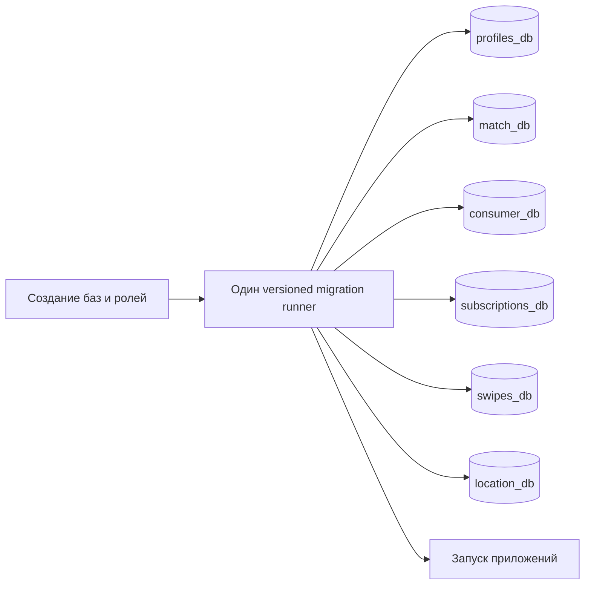

# Концепт: Соглашения по контрактам и версионированные миграции

Статус: УТВЕРЖДЁН 2026-08-09  
Автор: Codex вместе с Michael · Slug: `contract-conventions-versioned-migrations`

## 1. Проблема

Владельцу проекта и оператору релиза нужны безопасные изменения контрактов и базы данных. Сейчас SQL выполняется только при создании нового PostgreSQL volume. Он не обновляет существующий volume. Несколько сервисов также могут менять таблицы через Hibernate. Поэтому нет единой истории миграций, а схемы могут расходиться.

В проекте есть OpenAPI-файл и общие классы событий, но нет общего правила для канонических форматов, проверок совместимости, читаемых копий и имён миграций.

Сейчас владелец должен менять bootstrap SQL, полагаться на ORM или пересоздавать базу. Это небезопасно для сохранённых данных и не даёт проверяемых доказательств релиза.

## 2. Контракты и поведение (простым текстом)

Что на входе:

- Версионированные SQL-файлы, принадлежащие одной прикладной базе.
- Текущее состояние базы и явные переменные окружения для подключения.
- Предлагаемые изменения HTTP-, event-, WebSocket- или schema-контрактов.

Что на выходе:

- Общий для проекта документ с соглашениями по контрактам.
- Упорядоченная схема базы и история миграций с checksum.
- Явный результат успеха или ошибки до запуска приложений.
- Команды для чистого старта, повторной миграции и явного принятия существующей схемы.

Что система гарантирует:

- Она управляет всеми шестью прикладными базами: profiles, match, consumer, subscriptions, swipes и location.
- Она применяет каждую миграцию один раз и проверяет checksum.
- Повторный запуск без новых миграций не меняет схему.
- При ошибке миграции прикладные сервисы не запускаются.
- При принятии существующей схемы данные сохраняются.

Чего система не делает:

- Она не меняет HTTP payload, Kafka topics или WebSocket.
- Она не управляет базой Keycloak и не пересоздаёт постоянные volumes.
- Она не делает автоматический baseline неизвестной непустой схемы.
- Она не сохраняет пароли базы в Git.
- Она не разворачивает и не мигрирует живую production-базу в рамках этого изменения репозитория.

## 3. Функциональные требования

| ID | Требование | Как проверяем |
|---|---|---|
| FR-1 | Репозиторий задаёт одно общее соглашение для HTTP, events, WebSockets, миграций базы, имён, читаемых копий, проверок совместимости и частоты bug audit. | Проверяем документ по обязательным разделам. |
| FR-2 | Каждая из шести прикладных баз имеет свою папку упорядоченных миграций и baseline версии 1. | Проверяем папки и запускаем миграции на пустых базах. |
| FR-3 | Создание баз и ролей завершается до migrator, а миграции — до зависимых сервисов. | Проверяем Compose dependencies и сценарии успеха и ошибки. |
| FR-4 | Migrator хранит применённые версии и checksums и пропускает их при повторном запуске. | Запускаем дважды и проверяем историю. |
| FR-5 | Непустая база без истории отклоняется до явной проверки и baseline оператором. | Запускаем legacy fixture, проверяем отказ, затем baseline и migrate. |
| FR-6 | В production-shaped Compose сервисы проверяют схему, а не создают и не обновляют её автоматически. | Запускаем с правильной и неправильной схемой. |
| FR-7 | Ошибка миграции возвращает ненулевой код и блокирует все зависимые сервисы. | Добавляем временную ошибочную миграцию и проверяем контейнеры. |
| FR-8 | Репозиторий описывает чистый старт, принятие схемы, обычную миграцию, восстановление и backup. | Делаем dry run команд на fixtures. |

## 4. Нефункциональные требования

| ID | Требование (с числом) | Как измеряем |
|---|---|---|
| NFR-1 | Миграции покрывают 6 из 6 прикладных баз. | Сравниваем список баз с конфигурацией migrator. |
| NFR-2 | 100% применённых миграций имеют версию и сохранённый checksum. | Проверяем таблицу истории каждой базы. |
| NFR-3 | Повторный запуск без новых файлов выполняет 0 schema DDL и завершается успешно. | Сравниваем схему и историю до и после. |
| NFR-4 | При ошибке migration запускается 0 зависимых контейнеров приложений. | Выполняем сценарий ошибки и проверяем Compose. |
| NFR-5 | Релиз принятия содержит 0 разрушающих schema statements и сохраняет 100% строк fixtures. | Проверяем SQL и строки до и после. |
| NFR-6 | В репозиторий добавляется 0 database secrets или production credentials. | Проверяем diff и запускаем secret scan. |
| NFR-7 | Путь миграций добавляет не больше 1 нового runtime image и 0 migration libraries в сервисы. | Проверяем Compose и manifests. |
| NFR-8 | Проверка использует PostgreSQL/PostGIS 17-3.4, как production-shaped Compose. | Записываем image и результат. |

## 5. Вне рамок

- Автоматическое исправление неизвестного schema drift.
- Живой production rollout или доступ к production data.
- Несвязанные data backfills.
- Изменения API, event payload, topic или WebSocket.
- Управление схемой Keycloak.
- CI quality gates и rolling quality metrics, кроме доказательств этого изменения.

## 6. Предлагаемое решение

### Компоненты

| Компонент | Ответственность |
|---|---|
| Документ соглашений | Определяет форматы, совместимость, имена, читаемые копии, владение миграциями и частоту audit. |
| PostgreSQL init script | Создаёт только роли, базы и extensions, но не прикладные таблицы. |
| Центральный migrator | Запускает упорядоченные миграции с checksum для каждой базы. |
| Папки миграций сервисов | Разделяют baseline и дальнейшие изменения каждой базы. |
| Compose dependencies | Блокируют приложения до успешного завершения migrator. |
| ORM settings | Проверяют схему и не обновляют её в production-shaped stack. |
| Руководство принятия | Требует проверку схемы и backup до baseline непустой базы. |

### Основной поток

1. PostgreSQL создаёт шесть баз, роли и нужные PostGIS extensions.
2. Migrator ждёт health PostgreSQL.
3. Он обрабатывает шесть папок миграций в фиксированном порядке.
4. Он применяет отсутствующие миграции в транзакции, где PostgreSQL это поддерживает.
5. Он сохраняет version, description, checksum, duration и result.
6. При первой ошибке он возвращает ненулевой код.
7. Compose запускает приложения только после готовности всех баз.
8. Следующие релизы добавляют новые неизменяемые migration files.
9. Для legacy базы оператор проверяет схему и backup, затем явно записывает baseline версии 1. Automatic baseline-on-migrate выключен.

### Данные и хранение

Каждая база получает свою таблицу истории. Текущий SQL каждой базы становится baseline версии 1. Новые миграции получают возрастающие версии и понятные имена. Общий неиспользуемый baseline удаляется после проверки потребителей.

### Внешние системы

Решение использует текущий PostgreSQL/PostGIS и один закреплённый image migrator. Credentials остаются в environment variables. Новая база или application framework не добавляется.

### Поведение при сбоях

При ошибке migrator возвращает ненулевой результат, а приложения остаются остановлены. Одна база может быть впереди после ошибки на следующей базе, но приложения не стартуют. Повторный запуск продолжает работу по истории. Оператор добавляет новую исправляющую миграцию и не редактирует применённый файл или checksum.

### Отклонённые альтернативы

Выбранная база: один центральный migrator даёт историю Java- и Go-базам без migration-кода в каждом сервисе.

| Вариант | Почему не взяли | Незакрытое требование |
|---|---|---|
| Оставить PostgreSQL init scripts | Они работают только для нового volume. | FR-4, FR-5, NFR-2 |
| Разрешить Hibernate менять таблицы | Нет общей истории, схема может расходиться с SQL. | FR-4, FR-6, NFR-2 |
| Добавить library в каждый сервис | Дублируется Java/Go конфигурация и зависимости. | NFR-7 |
| Пересоздавать базы | Теряются данные. | NFR-5 |
| Автоматически делать baseline | Неверная схема может быть принята без проверки. | FR-5, NFR-5 |

## 7. Открытые вопросы

Блокирующих вопросов нет. Реализация исходит из сохранения развёрнутых данных. Миграция живой production-базы является отдельным действием релиза с явным подтверждением.
