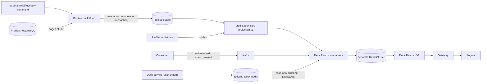

# Концепт: автономный Deck Read

Статус: **УТВЕРЖДЁН 2026-08-11**
Автор: Codex вместе с Michael · Slug: `deck-read-cqrs`

Linear Project Document: [Phase 1 — Concept (RU)](https://linear.app/mischa8925/document/phase-1-concept-ru-ce53fdcdd0a0)

## 1. Проблема

Deck Read сейчас синхронно запрашивает Profiles для user→profile mapping и hydration карточек, хранит authoritative fallback в памяти одной реплики и отвечает из тех же Redis keys, которыми владеет Deck. Это связывает availability read API с Profiles, мешает независимому горизонтальному масштабированию и не даёт восстанавливаемой распределённой read model.

При этом существующий Deck уже владеет расчётом порядка и должен остаться без изменений. Задача — сделать автономным только чтение, не вводя второй Builder и не перенося scoring.

## 2. Контракты и поведение простым текстом

На входе:

- ordered `DeckEntry` и build timestamp из существующего Deck Redis;
- полные versioned card events от Profiles;
- существующие `swipe-saved` и `match.created` события;
- JWT subject, opaque cursor и limit от API-клиента.

### Identity vocabulary

- `viewerUserId` — Keycloak userId из JWT `sub`; существует только на API boundary и в локальном mapping.
- `viewerProfileId` — Profiles aggregate id; это фактический `viewerId` существующего Deck, Redis keys, ensure endpoint, swipe и match events.
- Deck Read разрешает `viewerUserId → viewerProfileId` локально через profile projection и после этого использует только `viewerProfileId` для snapshot/repeat/match keys.

На выходе:

- локальная Redis Cluster projection карточек и viewer snapshots;
- `GET /api/v2/deck` с generation-aware pagination;
- deprecated `GET /api/v1/deck` как bare array из той же локальной проекции.

Система гарантирует:

- отсутствие синхронного Profiles lookup на read path;
- fresh перед repeat;
- PASS/LIKE repeat только после 30 секунд refresh или двух ошибок и не дольше 7 дней;
- match/deleted никогда не возвращаются;
- после потери Read Cluster не возвращается ложная пустая колода.

Система не делает:

- не меняет `services/deck`, scoring или его Redis keys;
- не использует Kafka как вечный архив;
- не добавляет новую PostgreSQL базу;
- не реализует полный block-flow.

## 3. Функциональные требования

| ID | Требование | Как проверяем |
|---|---|---|
| FR-1 | Authenticated клиент получает v2 page с opaque cursor, generation, cursorReset и состоянием READY/REFRESHING/DEGRADED/EMPTY; miss возвращает 202 BUILDING. | HTTP acceptance + OpenAPI validation. |
| FR-2 | Deprecated v1 сохраняет bare-array success contract и читает только локальную Read Cluster projection. | HTTP и architecture acceptance. |
| FR-3 | Profiles публикует полную `profile.deck-card-projection.v1` через outbox при profile/photo mutation/delete. Для initial fill и recovery оператор явно запускает maintenance-job: он читает PostgreSQL страницами по 500, атомарно добавляет события в тот же outbox и сохраняет durable cursor, поэтому после рестарта продолжает со следующей страницы. | Profiles boundary acceptance + AsyncAPI/data-contract validation. |
| FR-4 | Deck Read применяет profile/event versions идемпотентно и не откатывает projection старым или duplicate event. | Projection acceptance с duplicate/out-of-order сценариями. |
| FR-5 | Deck Read сохраняет ensure-on-miss и стабильно импортирует ordering из existing Deck Redis, проверяя build timestamp до и после ZSET; source entry с `isSwiped=true` не попадает во fresh; `services/deck` не меняется. | Architecture/source-import acceptance. |
| FR-6 | Fresh всегда предшествует repeat; PASS/LIKE становятся repeat после 30 секунд или двух consecutive failures; успешный ensure без source ZSET остаётся BUILDING 30 секунд и затем материализуется как EMPTY без увеличения failure count; snapshot содержит не больше 500+500 IDs. | Snapshot policy acceptance с injected clock. |
| FR-7 | Swipe, match и profile delete немедленно удаляют карточку из активной выдачи; match/delete запрещают repeat. | Materializer acceptance. |
| FR-8 | При пустом/потерянном Read Cluster API возвращает 503 READ_MODEL_NOT_READY до завершения Profiles backfill, catch-up, count verification и safe replay/warm-up. | Recovery/readiness acceptance. |
| FR-9 | Gateway пропускает v1/v2 в Deck Read; Angular использует v2, polling 2s до 30s, затем retry + 10s background polling, generation reset и profileId dedup без замены текущей карточки. | Gateway и Angular acceptance. |

## 4. Нефункциональные требования

| ID | Требование с числом | Как измеряем |
|---|---|---|
| NFR-1 | `services/deck` получает 0 изменений в feature diff; Deck Read делает 0 synchronous Profiles calls на API read path. | Scoped diff и architecture test. |
| NFR-2 | v2 `limit` 1–100; один generation хранит максимум 500 fresh и 500 repeat; soft freshness 60 минут. | Contract + policy tests. |
| NFR-3 | Event delivery at-least-once; idempotency по eventId/version; bounded retry заканчивается DLT. | Consumer tests и AsyncAPI. |
| NFR-4 | Две Deck Read replicas безопасно делят partitions; viewer mutation атомарна в одной `{viewerProfileId}` slot и generation монотонна. | Kafka/Redis Cluster Testcontainers. |
| NFR-5 | Production topology минимум 3 masters + 3 replicas, AOF, backups и noeviction; integration topology 3 masters без replicas. | Config review и контролируемая проверка восстановления. |
| NFR-6 | Repeat и current snapshot hard retention 7 дней; old generations около 30 минут; swipe/match replay retention не меньше 7 дней. | TTL/retention tests и broker config. |
| NFR-7 | Backfill обрабатывает максимум 500 профилей за страницу; outbox rows страницы и её cursor фиксируются в одной Profiles PostgreSQL транзакции. | Transaction/restart acceptance test. |

## 5. Вне рамок

- Любые изменения `services/deck`.
- Deck Builder или discovery projection.
- Полноценный user block-flow — [MIS-16](https://linear.app/mischa8925/issue/MIS-16/backlog-complete-user-block-flow-across-deck-and-deck-read).
- Новая PostgreSQL база.
- Production deployment и performance SLO.

## 6. Решение

### Владение данными

В существующем Redis Deck Read читает только `deck:<viewerProfileId>` и `deck:build:ts:<viewerProfileId>` и никогда не пишет. Параметр `viewerId` существующего ensure endpoint также означает profileId. `deck:stale:*`, locks, reverse indexes, invalidation, recent viewers и preferences остаются исключительно внутренними деталями Deck.

Новый cluster хранит `dr:profile:{profileId}:card`, `dr:user:{viewerUserId}:profile`, backfill readiness и viewer-local snapshot/repeat/match/event/refresh keys. Все viewer keys имеют форму `dr:viewer:{viewerProfileId}:...`; Redis hash tag содержит именно profileId. Отдельный profile→viewers reverse index Deck Read не нужен: delete/inactive отсекается карточной tombstone, а swipe/match — viewer mutation projection при чтении.

Active card projection не имеет семидневного TTL: это materialized read model. Семь дней относятся к repeat eligibility и hard retention current snapshot. Profile tombstone хранится минимум семь дней.

### Восстановление

Profiles PostgreSQL — authoritative recovery source карточек. Kafka переносит изменения и backfill; compacted profile topic допустим как ускорение, но не как единственный backup. При полной потере Read Cluster:

1. readiness становится NOT_READY, v1/v2 возвращают 503;
2. оператор один раз запускает internal maintenance-job в Profiles с новым `backfillRunId`; job не запускается при каждом старте сервиса;
   конкретно: генерирует UUID и вызывает mTLS `POST /api/v1/profiles/internal/deck-card-projection/backfills/{runId}` на internal port `8011`; после timeout/restart повторяет POST с тем же UUID и проверяет `GET` на том же URI;
3. job читает profiles, preferences, photos и hobbies по `profileId` в стабильном порядке, максимум по 500 строк;
4. для страницы Profiles строит обычные `profile.deck-card-projection.v1` с текущим aggregate version;
5. в одной PostgreSQL транзакции job добавляет события страницы в существующий `profile_event_outbox` и сохраняет `lastProfileId`/processed count в checkpoint текущего run;
6. обычный outbox publisher отправляет эти записи в Kafka; прямой publish из backfill запрещён;
7. если Profiles остановился, тот же run продолжает после сохранённого `lastProfileId`; повторная страница безопасна из-за eventId/version idempotency;
8. параллельные обычные profile/photo updates продолжают публиковаться; более старый backfill version не откатывает Deck Read projection;
9. после последней страницы backfill получает `ENQUEUED`; recovery ждёт, пока outbox этого run будет опубликован, profile consumer lag станет нулём и количество карточек совпадёт;
10. Deck Read применяет cards/mappings с version guards;
11. fresh ordering импортируется из существующего Deck Redis;
12. swipe/match replay выполняется отдельными новыми recovery consumer groups с `auto.offset.reset=earliest`; штатные committed offsets не считаются replay, а нулевой lag без retention/count checks не доказывает полноту;
13. если история неполна, отдельный `repeat-ready` gate остаётся закрыт на безопасный warm-up, при этом verified fresh уже может работать;
14. общий `ready` открывается после profile/count/lag checks, а `repeat-ready` — только после доказанной полноты семидневной swipe/match истории.

Точный wire contract команды и статуса: [`profiles-deck-card-backfill.openapi.yaml`](../../contracts/http/profiles-deck-card-backfill.openapi.yaml). Операционная последовательность с проверками и recovery drill описана в [`04-implementation/recovery-runbook.md`](04-implementation/recovery-runbook.md).

Checkpoint хранится в существующей Profiles PostgreSQL, а не в Read Cluster: потеря Read Cluster не должна уничтожать прогресс восстановления. Для этого feature добавляет небольшую таблицу backfill runs и nullable linkage из outbox row к `backfillRunId`; новая база не создаётся.

### Отклонённые альтернативы

| Вариант | Почему не выбран |
|---|---|
| Переделать Deck в event-driven Builder | Меняет нецелевой сервис и дублирует уже существующий owner scoring. |
| Синхронно читать Profiles | Оставляет availability coupling и per-replica caches. |
| TTL 7 дней для всех cards | Неизменяемые профили исчезнут, хотя остаются активными. |
| Восстанавливать всё только из Kafka | Требует вечного retention и делает broker единственным backup. |
| Использовать существующий Redis для read model | Смешивает ownership и текущие multi-key Deck операции не cluster-safe. |

## 7. Будущая production-проверка

- [MIS-14: production backup/restore validation](https://linear.app/mischa8925/issue/MIS-14/future-scope-production-read-cluster-backuprestore-validation)
- [MIS-15: deployed backfill/catch-up/repeat recovery](https://linear.app/mischa8925/issue/MIS-15/future-scope-deployed-backfill-kafka-catch-up-and-repeat-recovery)
- [MIS-30: production rollout and v1/v2 traffic shadowing](https://linear.app/mischa8925/issue/MIS-30/future-scope-deck-read-production-rollout-and-v1v2-traffic-shadowing)

Эти задачи не блокируют engineering merge: они требуют ещё не определённого production/deployment окружения и выполняются перед реальным production cutover.
