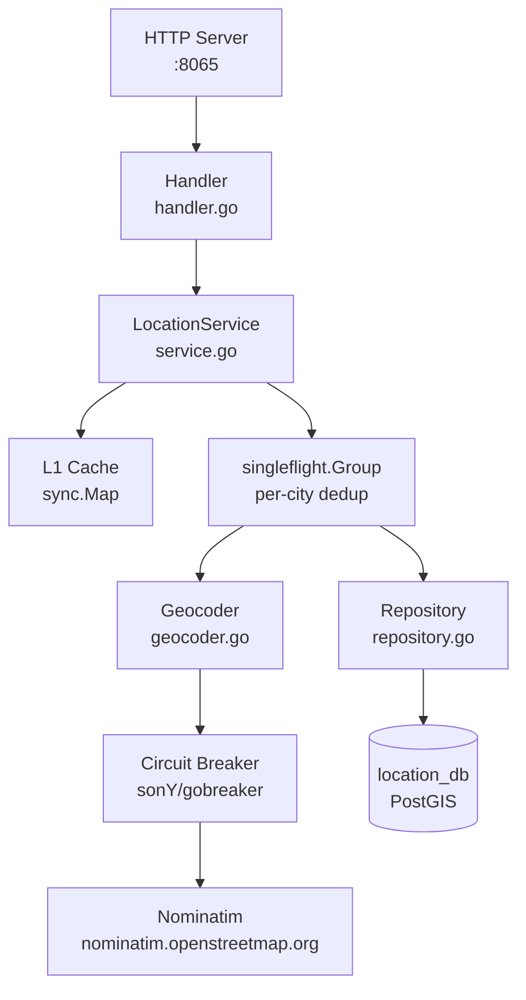
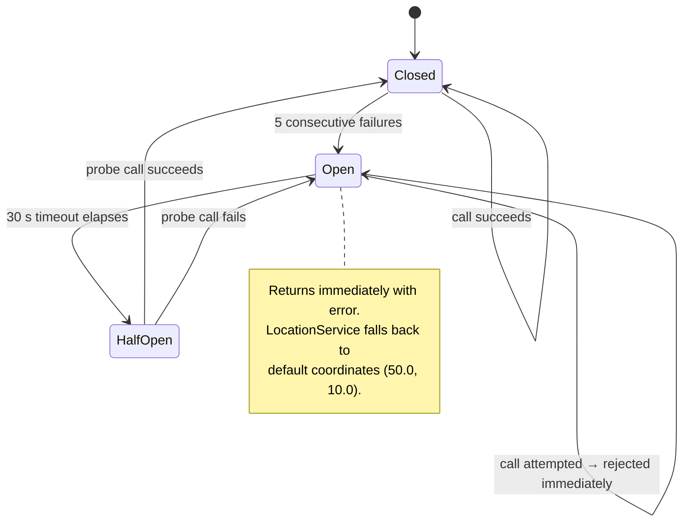
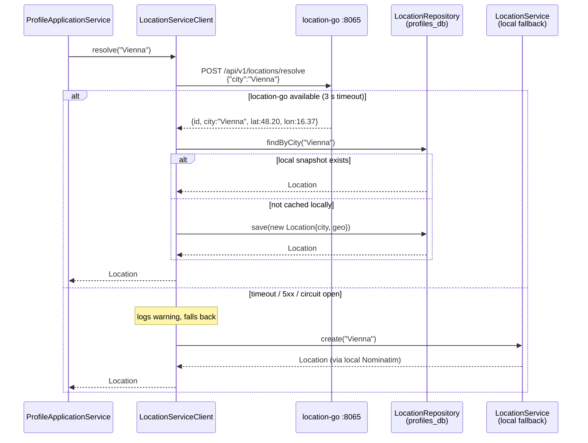
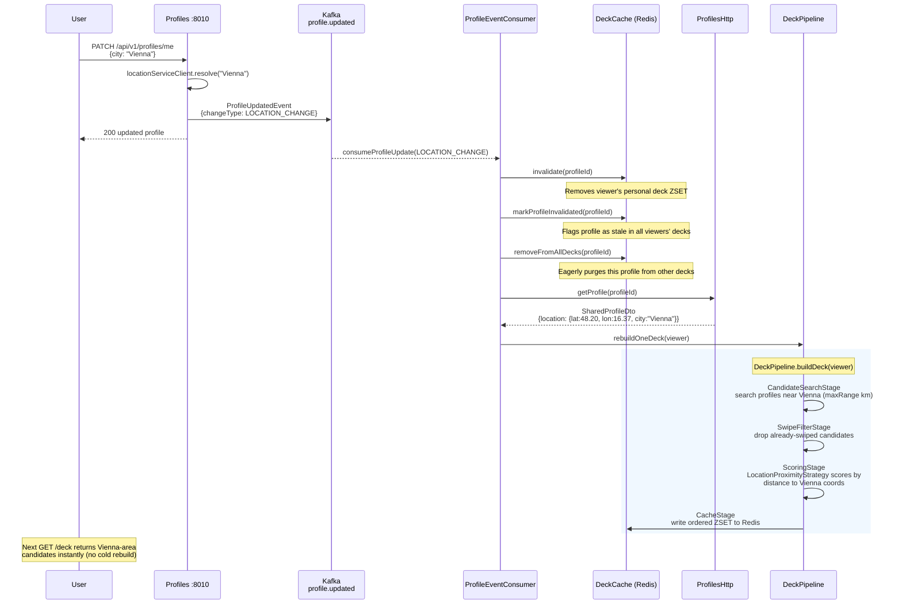

# location-go — architecture

## Component overview



---

## Resolve request — cache flow

A city that is already known never reaches the geocoder.
The `singleflight.Group` ensures concurrent requests for the same unknown city
share one geocoder + DB round-trip (replaces the Java `ReentrantLock` map).

```mermaid
sequenceDiagram
    participant Caller as Caller<br/>(profiles)
    participant H as Handler
    participant S as LocationService
    participant L1 as L1 Cache<br/>(sync.Map)
    participant SF as singleflight
    participant R as Repository
    participant DB as location_db
    participant G as Geocoder
    participant N as Nominatim

    Caller->>H: POST /api/v1/locations/resolve<br/>{"city":"Berlin"}
    H->>S: Resolve(ctx, "Berlin")
    S->>L1: Load("Berlin")

    alt L1 hit
        L1-->>S: *Location
        S-->>H: *Location
        H-->>Caller: 200 OK
    else L1 miss
        S->>SF: Do("city:Berlin", func)
        Note over SF: All concurrent "Berlin" callers<br/>wait here; only one proceeds

        SF->>R: FindByCity(ctx, "Berlin")
        R->>DB: SELECT id, city, ST_Y(geo), ST_X(geo)<br/>FROM location WHERE city='Berlin'

        alt L2 hit (DB)
            DB-->>R: row
            R-->>SF: *Location
        else L2 miss
            SF->>G: Geocode(ctx, "Berlin")
            G->>N: GET /search?q=Berlin&format=jsonv2

            alt geocode success
                N-->>G: [{lat:"52.51", lon:"13.38"}]
                G-->>SF: lat=52.51, lon=13.38
            else failure or circuit open
                G-->>SF: default (50.0, 10.0)
            end

            SF->>R: Save(ctx, location)
            R->>DB: INSERT INTO location(id,city,geo,...)<br/>VALUES($1,$2,ST_SetSRID(ST_MakePoint($3,$4),4326),...)
            DB-->>R: saved
            R-->>SF: *Location
        end

        SF-->>S: *Location (shared by all waiters)
        S->>L1: Store("Berlin", *Location)
        S-->>H: *Location
        H-->>Caller: 200 {"id":"...","city":"Berlin",<br/>"latitude":52.51,"longitude":13.38}
    end
```

---

## Geocoder resilience



Each call to Nominatim also retries up to 3 times with exponential back-off
(500 ms → ~810 ms → ~1 310 ms) before the circuit breaker records it as a failure.

---

## Profiles integration — strangler-fig

`profiles` calls `location-go` first and falls back to its local `LocationService`
(which also calls Nominatim). The local `location` table in `profiles_db` is kept
as a cache snapshot to maintain the JPA FK on `Profile.location_id`.



---

## Real-time deck rebuild on location change

When a user changes city or GPS coordinates, `profiles` emits a
`ProfileUpdatedEvent{changeType: LOCATION_CHANGE}`. The deck service
reacts by invalidating stale data **and** immediately rebuilding the
viewer's deck from candidates near the new location.


