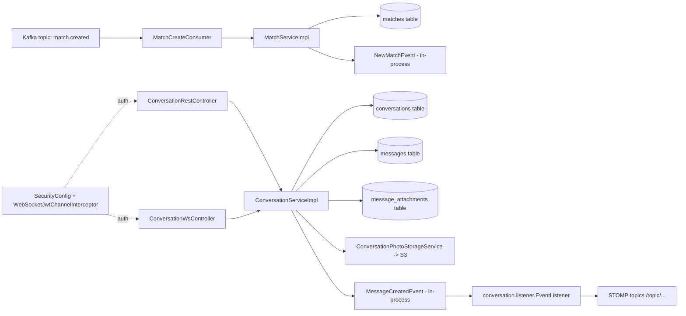

# Match Service Architecture

## 1) High-level architecture

The `match` service is a Spring Boot 4 module that combines two bounded contexts:

1. `match` context: consumes match events from Kafka and persists canonical match records.
2. `conversation` context: manages one-to-one conversations and real-time message delivery.

It uses:

- Spring Boot (`webmvc`, `data-jpa`, `websocket`, `oauth2-resource-server`, `kafka`)
- PostgreSQL via Spring Data JPA
- Kafka for inbound match creation events
- STOMP/WebSocket for real-time message fan-out
- AWS S3 (and optional CloudFront URL rewrite) for photo message storage

At runtime, it acts as both:

- An event-driven consumer (`match.created` topic)
- A synchronous API service (REST + WebSocket endpoints)

## 2) Bounded contexts and dependencies

### Context map

- `match` creates and stores match state.
- `conversation` stores chats and broadcasts new messages.
- `security` provides JWT conversion and WebSocket auth interception.
- `config` provides AWS/S3 infrastructure beans and property binding.

The `conversation` context does not currently consume `NewMatchEvent`; conversation creation is manual via REST.

### Component view



## 3) Runtime flows

## 3.1 Kafka-driven match creation flow

1. `match.kafka.MatchCreateConsumer` receives `MatchCreateEvent` from `${app.kafka.topic.match-created}`.
2. Listener uses manual acknowledgment (`AckMode.MANUAL`).
3. `MatchServiceImpl#create`:
   - Parses profile IDs from event strings.
   - Normalizes participant ordering with `MatchId.normalized(...)`.
   - Persists `match.model.Match` with status `ACTIVE`.
   - Publishes in-process `NewMatchEvent`.
4. On success, Kafka offset is acknowledged.
5. On exception, listener rethrows and the default error handler handles retry behavior.

Notes:

- `MatchAnalyticsServiceImpl` exists but is not wired into this flow right now.
- `MatchController#createMatch()` is currently empty (no manual API path implemented).

## 3.2 Conversation creation flow (REST)

1. `POST /rest/conversations` receives `CreateConversationRequest`.
2. `ConversationServiceImpl#createConversation` validates both participants.
3. IDs are normalized (lower UUID first) to enforce canonical pair ordering.
4. Existing conversation is reused if found by `(participant1_id, participant2_id)`.
5. Otherwise, a new active `Conversation` is stored and returned.

## 3.3 Text/media message flow (WebSocket)

1. Client connects to `/ws` and authenticates with `Authorization: Bearer ...` STOMP header.
2. Client sends to `/app/chat.send` (`@MessageMapping` in `ConversationWsController`).
3. `ConversationServiceImpl#sendMessage`:
   - Validates sender membership and active conversation status.
   - Validates payload semantics by `MessageType`.
   - Enforces idempotency by `(sender_id, client_message_id)`.
   - Persists `Message` + optional `MessageAttachment` rows.
   - Publishes `MessageCreatedEvent`.
4. `conversation.listener.EventListener` listens `AFTER_COMMIT` and broadcasts to:
   - `/topic/conversations/{conversationId}`
   - `/topic/messages`

## 3.4 Photo upload flow (REST multipart)

1. `POST /rest/conversations/{conversationId}/messages/photos` with multipart file.
2. `ConversationServiceImpl#sendPhotoMessage` validates sender and conversation access.
3. `ConversationPhotoStorageService`:
   - Validates type (`jpeg`, `png`, `webp`), size (<= 5MB), dimensions.
   - Optionally ensures bucket exists for local/custom endpoint setups.
   - Uploads object to S3 key:
     `chat/photos/{conversationId}/{senderId}/{clientMessageId}/{uuid}.{ext}`
4. Service creates `Message` with type `IMAGE` and attachment metadata.
5. Message is persisted and event is published/broadcast after commit.

## 4) Package and folder structure

```text
services/match
├── src/main/java/com/tinder/match
│   ├── MatchApplication.java
│   ├── config
│   │   ├── AwsProperties.java
│   │   └── S3BucketConfiguration.java
│   ├── security
│   │   ├── SecurityConfig.java
│   │   ├── JwtAuthConverter.java
│   │   └── WebSocketJwtChannelInterceptor.java
│   ├── match
│   │   ├── MatchController.java
│   │   ├── MatchService.java
│   │   ├── MatchAnalyticsService.java
│   │   ├── NewMatchEvent.java
│   │   ├── dto/MatchRequestDto.java
│   │   ├── implementation/{MatchServiceImpl, MatchAnalyticsServiceImpl}.java
│   │   ├── kafka/{KafkaConfig, MatchCreateConsumer, MatchCreateEvent}.java
│   │   ├── model/{Match, MatchId, MatchStatus, MatchChatAnalytics, MatchChatAnalyticsId}.java
│   │   └── repository/{MatchRepository, MatchChatAnalyticsRepository}.java
│   └── conversation
│       ├── ConversationService.java
│       ├── controller/{ConversationRestController, ConversationWsController}.java
│       ├── dto/{ConversationDto, CreateConversationRequest, MessageDto, MessageAttachmentDto}.java
│       ├── event/MessageCreatedEvent.java
│       ├── implementations/{ConversationServiceImpl, ConversationPhotoStorageService, WebsocketConfig}.java
│       ├── listener/EventListener.java
│       ├── model/{Conversation, ConversationStatus, Message, MessageAttachment, MessageType}.java
│       └── repository/{ConversationRepository, MessageRepository}.java
└── src/main/resources/application.yaml
```

## 5) Persistence model

## 5.1 Match tables

- `matches` (`Match`)
  - Embedded composite key `MatchId(profile1_id, profile2_id)`
  - Status lifecycle (`ACTIVE`, `INACTIVE`, `BLOCKED`, `UNMATCHED`)
  - Optimistic lock field `version`

- `match_chat_analytics` (`MatchChatAnalytics`)
  - Embedded key `MatchChatAnalyticsId(profile1_id, profile2_id)`
  - Chat analytics counters and first/last message markers
  - `@PrePersist`/`@PreUpdate` initialize counters and timestamps
  - Optimistic lock field `version`

## 5.2 Conversation tables

- `conversations` (`Conversation`)
  - UUID primary key `conversation_id`
  - Unique constraint on canonical participant pair
  - Status enum (`ACTIVE`, `DELETED`)

- `messages` (`Message`)
  - UUID PK + immutable `client_message_id`
  - Unique `(sender_id, client_message_id)` for dedup/idempotency
  - `ManyToOne` to `Conversation`
  - `OneToMany` attachments with cascade + orphan removal

- `message_attachments` (`MessageAttachment`)
  - URL/storage metadata and optional media dimensions/duration/hash

## 6) Security architecture

- HTTP security (`SecurityConfig`)
  - `/ws` endpoints are permitted at HTTP layer.
  - All other routes require JWT-based auth (resource server mode).
  - Stateless session policy.

- JWT principal mapping (`JwtAuthConverter`)
  - Uses JWT `sub` as principal name.
  - Merges standard authorities and Keycloak-style realm/resource roles.

- WebSocket security (`WebSocketJwtChannelInterceptor`)
  - On STOMP `CONNECT`, requires bearer token in native headers.
  - Decodes token with `JwtDecoder`, converts auth, sets authenticated user.
  - Rejects unauthenticated `SEND` and `SUBSCRIBE`.

Important implication:

- `ConversationWsController` expects `principal.getName()` to be a UUID sender ID. If `sub` is not UUID in the identity provider, message sends fail.

## 7) Configuration and infrastructure

- `application.yaml` defines:
  - PostgreSQL datasource and JPA behavior (`ddl-auto: update`)
  - Kafka bootstrap server and consumer defaults
  - OAuth2 resource server JWK URI
  - S3 bucket and optional CloudFront settings
  - AWS region/credentials/endpoint overrides

- AWS wiring (`AwsProperties`, `S3BucketConfiguration`):
  - Supports static credentials or default provider chain fallback.
  - Supports endpoint override for local S3-compatible services.
  - Registers both `S3Client` and `S3Presigner`.

## 8) Core patterns used

1. Feature-first packaging by bounded context (`match`, `conversation`).
2. Interface + implementation separation (`MatchService`, `ConversationService`, etc.).
3. Canonical pair normalization for symmetric relationships.
4. Idempotent message writes via client-generated IDs + DB uniqueness.
5. Transactional domain event publishing + `AFTER_COMMIT` side effects.
6. Hybrid API style: REST for commands/uploads, WebSocket for low-latency chat events.
7. Defensive validation at both DTO and service layers.
8. Optimistic locking and entity lifecycle hooks for consistency.
9. Manual Kafka acknowledgment for explicit commit control.

## 9) Current gaps and architectural notes

1. `MatchController#createMatch()` is empty and does not call service logic.
2. `MatchService#manualMatch()` exists but is not used by controller.
3. `MatchAnalyticsServiceImpl` is implemented but not connected to Kafka or domain events.
4. `MessageCreatedEvent.conversationSeq` is hardcoded to `0L` (no sequencing yet).
5. WebSocket endpoint allows all origins (`setAllowedOrigins("*")`), which is permissive.
6. Test coverage is minimal (`MatchApplicationTests` context load only).

## 10) Suggested evolution points

1. Add a listener for `NewMatchEvent` to auto-bootstrap `Conversation` rows if desired.
2. Wire analytics updates from message events to `match_chat_analytics`.
3. Introduce explicit schema migrations (Flyway/Liquibase) instead of `ddl-auto: update`.
4. Add integration tests for Kafka consumer flow and WebSocket auth/message paths.
5. Implement ordered conversation sequencing and include it in `MessageCreatedEvent`.
