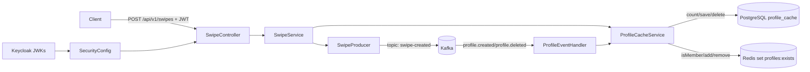

# Swipes Demo Service Architecture

## 1. High-Level Overview

`swipes-demo` is a Spring Boot service that accepts swipe decisions over HTTP and publishes them to Kafka. It also maintains a local profile-existence cache (PostgreSQL + Redis) that is synchronized from profile lifecycle Kafka events.

Primary responsibilities:

1. Accept authenticated swipe commands (`POST /api/v1/swipes`).
2. Validate input and ensure both profiles exist.
3. Publish a `swipe-created` event to Kafka.
4. Consume `profile.created` and `profile.deleted` events to keep a local existence cache up to date.

High-level runtime dependencies configured in the service:

1. Keycloak/JWT JWK endpoint for auth verification.
2. Kafka for producing swipe events and consuming profile events.
3. PostgreSQL for persistent profile cache.
4. Redis for fast existence checks.



## 2. Request and Event Flows

## 2.1 Swipe Command Flow (`POST /api/v1/swipes`)

1. `SwipeController.swipe(...)` receives `SwipeDto` and calls `SwipeService.sendSwipe(...)`.
2. `SwipeService` parses both IDs as UUID and rejects invalid/identical IDs with `400`.
3. `SwipeService` calls `ProfileCacheService.existsAll(profile1Id, profile2Id)`.
4. `ProfileCacheService` checks Redis set membership for both IDs.
5. On Redis miss, it queries PostgreSQL with `countByProfileIdIn(...)` on a bounded elastic scheduler.
6. If both exist in DB, it backfills Redis and returns `true`.
7. If either is missing, `SwipeService` returns `404`.
8. If both exist, `SwipeService` builds `SwipeCreatedEvent` and delegates to `SwipeProducer`.
9. `SwipeProducer` serializes event to JSON and sends to Kafka topic `swipe-created` keyed by `profile1Id`.
10. Controller returns `200 OK` after send completion.

## 2.2 Profile Cache Synchronization Flow

1. `ProfileEventHandler` listens to topic `${kafka.topics.profile-created}` and `${kafka.topics.profile-deleted}`.
2. On create event, `ProfileCacheService.saveProfileCache(...)` upserts PostgreSQL record and adds profile ID to Redis set.
3. On delete event, `ProfileCacheService.deleteProfileCache(...)` deletes PostgreSQL record and removes profile ID from Redis set.
4. Redis write/remove failures are logged and suppressed to avoid breaking event processing.

## 3. Package and Folder Structure

```text
services/swipes-demo/
  pom.xml
  ARCHITECTURE.md
  src/main/java/com/example/swipes_demo/
    SwipesDemoApplication.java
    SecurityConfig.java
    KafkaConfig.java
    SwipeController.java
    SwipeService.java
    SwipeProducer.java
    SwipeDto.java
    SwipeCreatedEvent.java
    profileCache/
      ProfileCache.java
      ProfileCacheRepository.java
      ProfileCacheService.java
      ProfileDeleteEvent.java
      ProfileEvent.java
      kafka/
        KafkaConsumerConfig.java
        ProfileCreateEvent.java
        ProfileEventHandler.java
  src/test/java/com/example/swipes_demo/
    SwipeServiceTest.java
    SwipesDemoApplicationTests.java
  src/main/resources/
    application.yaml
  src/test/resources/mockito-extensions/
    org.mockito.plugins.MockMaker
```

## 4. Java Class Responsibilities (Complete Inventory)

| File | Responsibility |
| --- | --- |
| `SwipesDemoApplication` | Spring Boot entry point. |
| `SecurityConfig` | WebFlux security chain, requires JWT authentication for all exchanges, disables CSRF. |
| `KafkaConfig` | Creates reactive Kafka producer bean (`KafkaSender<String,String>`) and `ObjectMapper`. |
| `SwipeController` | HTTP API adapter for swipe creation (`/api/v1/swipes`). |
| `SwipeService` | Core swipe command logic: validation, profile existence check, event creation, publish orchestration. |
| `SwipeProducer` | Reactive Kafka producer for `swipe-created` topic. |
| `SwipeDto` | API request contract with validation (`@NotNull` IDs). |
| `SwipeCreatedEvent` | Outbound event payload for swipe decisions. |
| `profileCache/ProfileCache` | JPA entity mapped to `profile_cache`. |
| `profileCache/ProfileCacheRepository` | JPA repository with `countByProfileIdIn(...)` query method. |
| `profileCache/ProfileCacheService` | Profile existence read path + create/delete cache update handlers (Postgres + Redis). |
| `profileCache/ProfileDeleteEvent` | Inbound profile delete event contract. |
| `profileCache/ProfileEvent` | Generic profile event model (currently not used in active flow). |
| `profileCache/kafka/KafkaConsumerConfig` | Typed Spring Kafka consumer factories/container factories for profile create/delete events. |
| `profileCache/kafka/ProfileCreateEvent` | Inbound profile create event contract. |
| `profileCache/kafka/ProfileEventHandler` | Kafka listeners that dispatch profile events into cache service. |
| `SwipeServiceTest` | Unit tests for swipe service validation and publish behavior. |
| `SwipesDemoApplicationTests` | Spring context smoke test. |

## 5. Architecture Patterns in Use

## 5.1 Layered Service Pattern

The service uses a clear application layering:

1. API layer: `SwipeController`.
2. Application logic layer: `SwipeService`, `ProfileCacheService`.
3. Integration layer: `SwipeProducer`, `ProfileEventHandler`, Kafka configs.
4. Persistence/cache layer: `ProfileCacheRepository` + Redis template.

## 5.2 Event-Driven Integration

1. Outbound command side publishes `swipe-created` events.
2. Inbound synchronization side consumes profile lifecycle events.
3. The service is eventually consistent with upstream profile domain through Kafka.

## 5.3 Cache-Aside with Read-Through Fallback

`existsAll(...)` implements a two-stage lookup:

1. Fast path in Redis set (`profiles:exists`).
2. Fallback to PostgreSQL on miss.
3. Redis backfill after successful DB confirmation.

This pattern reduces DB load on repeated checks while preserving correctness through DB fallback.

## 5.4 Reactive + Blocking Bridge

The HTTP path is reactive (WebFlux + Reactor), but JPA repository calls are blocking. Blocking read calls are wrapped with `Mono.fromCallable(...).subscribeOn(Schedulers.boundedElastic())` to avoid blocking event-loop threads. Write paths in profile event handlers are synchronous JPA operations triggered by Kafka listener threads.

## 5.5 Best-Effort Side Effects

Redis mutations in profile event handlers are fire-and-forget (`subscribe()`), with errors logged and suppressed. This keeps the primary flow resilient but can temporarily diverge Redis from DB until next fallback/backfill.

## 5.6 Immutable Event Contracts

Inbound profile events use immutable Lombok `@Value` classes with explicit `@JsonCreator` constructors. This provides stable deserialization contracts and explicit field mapping.

## 6. Data and Contract Model

## 6.1 HTTP Contract

Endpoint:

1. `POST /api/v1/swipes`

Request body (`SwipeDto`):

1. `profile1Id: String` (required, UUID format enforced in service)
2. `profile2Id: String` (required, UUID format enforced in service)
3. `decision: boolean` (`true` = right swipe, `false` = left swipe)

Responses:

1. `200 OK` when event is published.
2. `400 Bad Request` for invalid UUIDs or same profile IDs.
3. `404 Not Found` when one or both profiles are missing.

## 6.2 Kafka Contracts

Produced:

1. Topic: `swipe-created`.
2. Key: `profile1Id`.
3. Value: serialized `SwipeCreatedEvent` JSON.

Consumed:

1. Topic from `${kafka.topics.profile-created}` mapped to `ProfileCreateEvent`.
2. Topic from `${kafka.topics.profile-deleted}` mapped to `ProfileDeleteEvent`.

## 6.3 Persistence Contracts

PostgreSQL table `profile_cache` (`ProfileCache` entity):

1. `profile_id` UUID primary key.
2. `user_id` non-null text.
3. `created_at` non-null timestamp (`Instant`).

Redis:

1. Key: `profiles:exists` (set).
2. Members: profile UUID strings.

## 7. Security Architecture

1. All exchanges require authentication.
2. OAuth2 resource server validates JWTs using configured JWK set URI.
3. CSRF is disabled (typical for stateless token-based APIs).

Security is centralized in `SecurityConfig`, so no endpoint-level permit rules are defined; everything is protected by default.

## 8. Configuration and Runtime Characteristics

From `application.yaml` and `pom.xml`:

1. Server port: `8040`.
2. Kafka bootstrap: `localhost:9092`.
3. Redis host/port: `localhost:6379`.
4. PostgreSQL: `127.0.0.1:54322/postgres`.
5. JPA DDL mode: `create-drop` (ephemeral schema lifecycle).
6. Java version: `21`.
7. Stack includes: WebFlux, Reactor Kafka, Spring Kafka, Spring Security OAuth2 Resource Server, Reactive Redis, Spring Data JPA.

Operational notes:

1. Local scripts `simple-load-test.sh` and `quick-perf-test.sh` target this service endpoint and Keycloak-based auth.
2. The service combines reactive APIs with blocking JPA persistence, so thread scheduling and DB pool sizing are important under load.

## 9. Testing Coverage

Current tests focus on the `SwipeService` command logic:

1. Reject when profiles do not exist (`404`).
2. Publish event when both profiles exist.
3. Reject same-profile swipes (`400`).

A Spring context load test verifies basic application wiring.

## 10. Notable Design Implications

1. The service behaves as a command producer plus read-optimized profile existence cache.
2. Profile existence checks prioritize latency (Redis) with correctness fallback (Postgres).
3. Kafka consumer deserialization is type-specific via dedicated container factories.
4. Event processing currently favors availability over strict failure propagation (errors are logged, not rethrown in handler methods).
5. `ProfileEvent` exists as a broader model but is not currently part of active processing paths.
